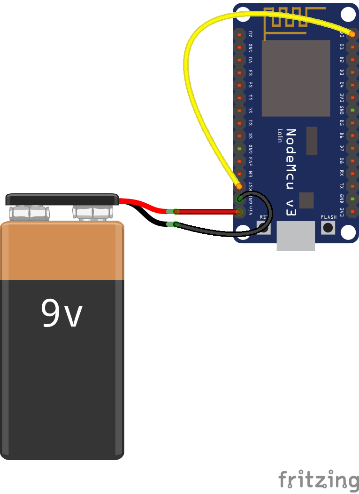

Horchbox
========

Horchbox is a listening device. It is based on a ESP8266 on a
nodemcu-devkit board that listens for Wifi-beacons and tells them to
an MQTT-Broker.

For instance, this device can be used to check presence of devices in
a room.

Sketch
------

- Connect Vin and GND to an external power supply.
- Connect GPIO16 (D0) with RESET to enable awakening from deep sleep.
- Put everything into a suitable case.

Configuration
-------------

Copy file `hbconfig_sample.lua` to `hbconfig.lua` and change the
settings inside.

Installation
-----------

[Build](https://nodemcu.readthedocs.io/en/master/en/build/)
and [flash](https://nodemcu.readthedocs.io/en/master/en/flash/) the
firmware onto the device.

Copy all lua files onto the device. Use one of the tools as described
in the
[nodemcu Documentation](https://nodemcu.readthedocs.io/en/master/en/upload/) 
for this.

Provide power for the device - for instance via a 9V Battery at the
VIN pin.
